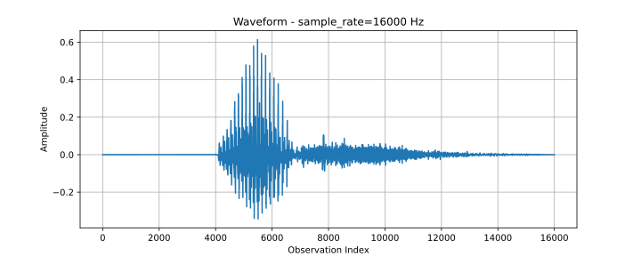
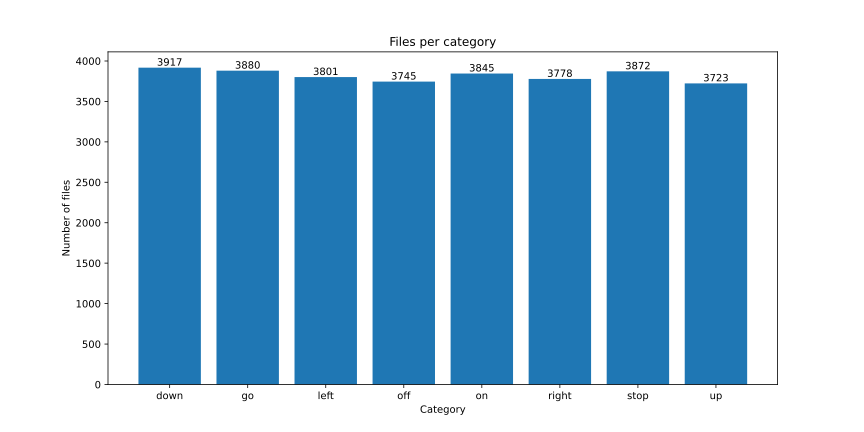
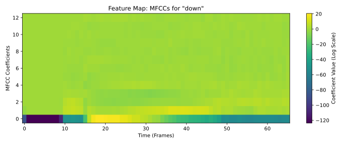
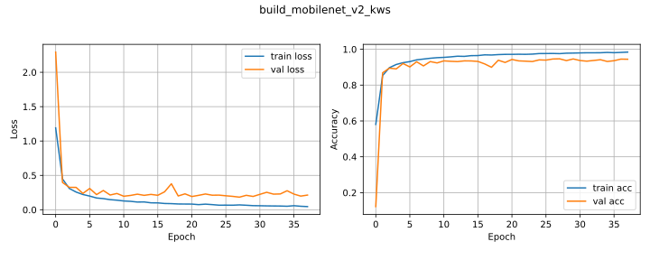

# EdgeAI Keyword Spotting: Low-Resource Audio Classification

## 1. Abstract

As part of my journey into EdgeAI, I undertook the [HarvardX Applications of TinyML course](https://www.edx.org/learn/tinyml/harvard-university-applications-of-tinyml). The course emphasizes the challenge of running complex neural networks on power-constrained microcontrollers (e.g., Arduino Nano 33 BLE Sense) with only 256KB of RAM and 1MB of Flash.

My objective was to modernize the course's theoretical concepts by building an efficient Keyword Spotting (KWS) system capable of classifying 8 voice commands ("up", "down", "left", "right", "on", "off", "stop", "go"). The specific goal was to leverage the most recent libraries to achieve high accuracy within a **<100KB** footprint, mastering model quantization in the process.

To achieve this, I implemented a rigorous experimental pipeline testing **two distinct architectures** ([MobileNetV1-based DS-CNN](https://arxiv.org/pdf/1704.04861) and [MobileNetV2](https://arxiv.org/pdf/1801.04381)). I conducted a grid search across **6 feature engineering configurations** (varying MFCCs, sample rates, and frame lengths) to identify the optimal input signal. Finally, I applied and evaluated **post-training quantization** to compress the best-performing candidate for embedded deployment.

Ultimately, the project achieved a test accuracy of **94.31%** using the quantized **MobileNetV2** architecture. Additionally, the quantized **DS-CNN** model demonstrated exceptional efficiency, achieving **93.10%** accuracy while occupying **4.6x less memory** than the first architecture, successfully demonstrating that modern quantization techniques can maintain high performance on strictly resource-constrained edge devices.

## 2. Methodology
This project follows the [CRISP-DM](https://cs.unibo.it/~danilo.montesi/CBD/Beatriz/10.1.1.198.5133.pdf) (Cross-Industry Standard Process for Data Mining) lifecycle to ensure scientific rigor and reproducibility.

### 2.1. Business Understanding
The deployment of Keyword Spotting (KWS) models on the edge is driven by critical operational requirements that cloud-based solutions cannot meet. To formalize these constraints, we adopt the **BLERP** framework (**B**andwidth, **L**atency, **E**conomics, **R**eliability, **P**rivacy) as described by Daniel Situnayake and Jenny Plunkett in *[AI at the Edge](https://www.oreilly.com/library/view/ai-at-the/9781098120191/)*:

- **Bandwidth (B)**: The system requires zero network dependency, avoiding the high data usage associated with streaming raw audio.
- **Latency (L)**: The system requires immediate inference times to ensure a seamless user experience. Processing audio and running an inference locally eliminates the lag associated with uploading data to the cloud and waiting for a response.
- **Economics (E)**: The target hardware is the Arduino Nano 33 BLE Sense, a low-cost, low-power microcontroller. This imposes strict physical constraints—specifically **256KB of RAM and 1MB of Flash**—which serve as the hard technical budget for our model's size and computational complexity.
- **Reliability (R)**: The device must operate reliably in offline environments or areas with unstable connectivity.
- **Privacy (P)**: User voice data never leaves the hardware.

### 2.2. Data Understanding

To train a robust Keyword Spotting model, we utilized the [Google Speech Commands Dataset v0.02](https://arxiv.org/pdf/1804.03209).

The dataset comprises a total of 97,862 observations distributed across 30 distinct audio categories. Each sample has a sampling rate of 16kHz and a fixed duration of 1 second. According to the original paper, the audio values have been normalized to a range between -1 and 1.

The visualization below depicts a sample of the command "down".

### 2.3. Data Preparation
This section outlines the data transformation pipeline required to adapt the raw Google Speech Commands dataset for Edge deployment. The process involves **filtering** specific target classes, **statistically validating** the class distribution to prevent inductive bias, and implementing a **Digital Signal Processing (DSP)** stage. This pipeline converts high-dimensional raw audio into compact Mel-Frequency Cepstral Coefficients (MFCCs), a step to meet the strict memory and latency constraints of the Arduino Nano 33 BLE Sense.

#### 2.3.1. Subset Selection
To tailor the model for a specific navigation use case, a filter were applied to the original 30 categories. We selected a subset of 8 target classes (*"up", "down", "left", "right", "on", "off", "stop", "go"*).

#### 2.3.2. Distribution Analysis & Statistical Validation

To ensure the model learns robust features, it is important to assess the dataset for class imbalance. A significant disparity in sample counts could introduce inductive bias, causing the model to favor the majority class. Ideally, the target categories should exhibit a uniform distribution.

The distribution of observations per class is visualized in the bar chart below:

While visual inspection suggests a balanced dataset, we rigorously validated this assumption using the **Chi-Square Goodness-of-Fit test ($\chi^2$)**.

**Hypothesis Testing**:
- **Null Hypothesis ($H_0$)**: The data is uniformly distributed across all classes (the dataset is perfectly balanced).
- **Alternative Hypothesis ($H_1$)**: At least one class deviates significantly from the uniform distribution.

**Results**:
The test yielded the following statistics:
- **$\chi^2$ statistic**: $\approx 8.77$
- **$p$-value**: $\approx 0.27$

**Conclusion**:
With a significance level ($\alpha$) of $0.05$, we observe that the $p\text{-value} > 0.05$. Consequently, we **fail to reject the null hypothesis**.

Statistically, there is no evidence to suggest that the class proportions differ significantly from a uniform distribution. In practical terms, this confirms that the dataset is balanced, eliminating the need for synthetic oversampling or class-weighted loss functions.

#### 2.3.3. Feature Engineering: Digital Signal Processing (DSP)

Raw audio data is high-dimensional (16,000 samples per second) and contains excessive noise and phase information irrelevant to keyword classification. To run efficiently on the Arduino Nano 33 BLE Sense, we must compress the signal while preserving the phonemic characteristics of human speech.

We implemented a standard **[Mel-Frequency Cepstral Coefficient (MFCC)](https://arxiv.org/pdf/1711.07128)** pipeline. This transformation converts the time-domain signal into a compact "acoustic fingerprint" mimicking the logarithmic perception of the human ear.

**The Transformation Pipeline:**
The preprocessing function applies the following sequential operations:

1.  **STFT (Short-Time Fourier Transform):** Slices the continuous signal into overlapping windows and computes the power spectrum.
    * *Frame Length:* $320 - 640$ samples ($20 - 40$ ms).
    * *Frame Step:* $240 - 320$ samples ($15 - 20$ ms).
2.  **Mel Filterbank:** Warps the frequency axis to the **Mel scale**, concentrating resolution in lower frequencies ($20 - 8000$ Hz) where human speech formants reside.
3.  **Logarithmic Scaling:** Applies a log operation ($log(x+\epsilon)$) to mimic the human ear's non-linear sensitivity to loudness (decibels).
4.  **MFCC Extraction:** Computes the Discrete Cosine Transform (DCT) to decorrelate the filter bank coefficients, resulting in a dense feature map.

**Visualizing the Dimensionality Reduction:**
The figure below illustrates the transformation of the word "down". Notice how the pipeline transitions from a dense, noisy waveform to a highly compact feature map that highlights the rising pitch of the word.
*Note: The image below is rendered with a colormap for visualization, but the model processes it as a single-channel tensor.*

**Impact on Efficiency:**
This pipeline drastically reduces the input size:
* **Input:** 16,000 raw samples (1 second).
* **Output:** $\approx 637 - 1980$ scalar features (depending on the grid search configuration).

This dimensionality reduction is the primary factor enabling real-time inference on a low-power microcontroller.

### 2.4. Modeling

This section details the development of the machine learning inference engine. Given the hardware constraints, standard Convolutional Neural Networks (CNNs) demands high computational power. Therefore, our modeling strategy focused on **parameter-efficient architectures**, **systematic preprocessing hyperparameter tuning**, and **post-training quantization** to achieve an optimal balance between accuracy, latency, and memory footprint.

#### 2.4.1. Architectures
We implemented two distinct architectures specifically designed for resource-constrained Edge AI applications:

1.  **DS-CNN (MobileNetV1-based):** A Depthwise Separable Convolutional Neural Network proposed in the seminal paper *[Hello Edge: Keyword Spotting on Microcontrollers](https://arxiv.org/pdf/1711.07128)*. This architecture is an adaptation of [MobileNetV1](https://arxiv.org/pdf/1704.04861), replacing standard convolutions with depthwise separable blocks to minimize operations.
2.  **MobileNetV2 KWS:** A specialized adaptation of the [MobileNetV2](https://arxiv.org/pdf/1801.04381) architecture. This model leverages inverted residual blocks with linear bottlenecks to maintain representational power while reducing parameter count.

Detailed implementations and layer configurations for both architectures can be examined in the notebook `training_keyword_spotting.ipynb`.

#### 2.4.2. Preprocessing Hyperparameter Grid Search
We prioritized the optimization of the input feature space to maximize signal fidelity before training. A systematic grid search was conducted across **6 distinct preprocessing configurations**, balancing temporal vs. spectral resolution.

The lower frequency limit (`low_freq`) was fixed at 20 Hz for all experiments. The tested combinations are detailed below:

| High Freq Limit (Hz) | Num MFCCs | Frame Length (Samples) | Frame Step (Samples) |
| :---: | :---: | :---: | :---: |
| 4000 | 13 | 640 | 320 |
| 8000 | 13 | 640 | 320 |
| 8000 | 13 | 480 | 320 |
| 8000 | 23 | 480 | 240 |
| 8000 | 23 | 320 | 240 |
| 8000 | 30 | 320 | 240 |

#### 2.4.3. Training Protocol
All models were trained using the TensorFlow Keras API adhering to the following protocol to ensure reproducibility and convergence:

* **Optimizer:** Adam ($\alpha = 0.001$).
* **Loss Function:** Sparse Categorical Crossentropy.
* **Batch Size:** 64.
* **Regularization:** An `EarlyStopping` callback (`monitor='val_loss'`, `patience=10`) was employed to prevent overfitting and restore the best performing weights.
* **Epochs:** Maximum of 100.

#### 2.4.4. Post-Training Quantization
To bridge the gap between the high-precision Python training environment (32-bit floating point: **4 bytes/parameter**) and the microcontroller's limited memory, we applied **Dynamic Range Quantization**.

Using the `ai_edge_litert` converter, weights were mapped to **Int8 (1 byte/parameter)**. This optimization reduced the final model size by a **factor of 4** (approx. 75% reduction), enabling deployment within the Flash memory constraints of the Arduino Nano 33 BLE Sense.

## 3. Results & Evaluation

This section presents the empirical findings of the deployment pipeline. The models were evaluated based on three critical metrics: **Test Accuracy**, **Model Size (Flash Usage)**, and **Training Stability**.

The table below details the performance of each architecture configuration, comparing the standard (Float32) and quantized (Int8) versions across different preprocessing hyperparameters.

| ID | Architecture | Model Type | Test Accuracy (%) | Size (Bytes) | High Freq (Hz) | MFCCs | Frame Length | Frame Step |
|---:|:---|:---|---:|---:|---:|---:|---:|---:|
| **19** | **MobileNetV2** | **Lite (Quantized)** | **94.31** | **84,080** | **8000** | **23** | **320** | **240** |
| 18 | MobileNetV2 | Normal | 94.24 | - | 8000 | 23 | 320 | 240 |
| 14 | MobileNetV2 | Normal | 93.92 | - | 8000 | 23 | 480 | 240 |
| 15 | MobileNetV2 | Lite (Quantized) | 93.85 | 84,080 | 8000 | 23 | 480 | 240 |
| 11 | MobileNetV2 | Lite (Quantized) | 93.82 | 84,080 | 8000 | 13 | 480 | 320 |
| 10 | MobileNetV2 | Normal | 93.78 | - | 8000 | 13 | 480 | 320 |
| 6 | MobileNetV2 | Normal | 93.72 | - | 8000 | 13 | 640 | 320 |
| 7 | MobileNetV2 | Lite (Quantized) | 93.72 | 84,072 | 8000 | 13 | 640 | 320 |
| 16 | DS-CNN | Normal | 93.10 | - | 8000 | 23 | 320 | 240 |
| **17** | **DS-CNN** | **Lite (Quantized)** | **93.10** | **18,216** | **8000** | **23** | **320** | **240** |
| 4 | DS-CNN | Normal | 93.00 | - | 8000 | 13 | 640 | 320 |
| 5 | DS-CNN | Lite (Quantized) | 92.97 | 18,200 | 8000 | 13 | 640 | 320 |
| 23 | MobileNetV2 | Lite (Quantized) | 92.93 | 83,912 | 8000 | 30 | 320 | 240 |
| 12 | DS-CNN | Normal | 92.87 | - | 8000 | 23 | 480 | 240 |
| 13 | DS-CNN | Lite (Quantized) | 92.84 | 18,216 | 8000 | 23 | 480 | 240 |
| 22 | MobileNetV2 | Normal | 92.84 | - | 8000 | 30 | 320 | 240 |
| 21 | DS-CNN | Lite (Quantized) | 92.80 | 18,136 | 8000 | 30 | 320 | 240 |
| 20 | DS-CNN | Normal | 92.77 | - | 8000 | 30 | 320 | 240 |
| 8 | DS-CNN | Normal | 92.35 | - | 8000 | 13 | 480 | 320 |
| 9 | DS-CNN | Lite (Quantized) | 92.31 | 18,216 | 8000 | 13 | 480 | 320 |
| 3 | MobileNetV2 | Lite (Quantized) | 92.21 | 83,976 | 4000 | 13 | 640 | 320 |
| 2 | MobileNetV2 | Normal | 92.21 | - | 4000 | 13 | 640 | 320 |
| 1 | DS-CNN | Lite (Quantized) | 91.76 | 18,136 | 4000 | 13 | 640 | 320 |
| 0 | DS-CNN | Normal | 91.76 | - | 4000 | 13 | 640 | 320 |

The empirical data reveals two distinct trends:
1.  **Architecture Superiority:** The **MobileNetV2** models consistently outperformed the DS-CNN variants in pure accuracy.
2.  **Temporal Resolution Impact:** Across both architectures, configurations with **smaller Frame Length and Frame Step** yielded higher test accuracy.

The **MobileNetV2 (ID 19)** emerged as the optimal model for accuracy, achieving **94.31%** with a quantized size of **82.1 KB**. This footprint falls comfortably within the Arduino Nano 33 BLE Sense's specifications (1MB Flash, 256KB RAM), ensuring feasible deployment without memory overflow; however, for extreme ultra-low-power scenarios, the **DS-CNN (ID 17)** presents a compelling alternative. While slightly less accurate at **93.10%**, it occupies only **17.8 KB**—a **4.6x reduction** in size compared to the MobileNetV2. This validates the DS-CNN as the superior choice when maximizing battery life and minimizing compute cycles is the priority over raw precision.

The learning curves for the top-performing models—MobileNetV2 (ID 18) and DS-CNN (ID 16) demonstrate robust convergence with minimal overfitting, as evidenced by the close tracking of training and validation accuracy.

**MobileNetV2 Training (ID 18):**

**DS-CNN Training (ID 16):**

**Analysis of Instability:**
While the overall trend is positive, we observe stochastic oscillation in the validation loss for both architectures. This instability suggests that the **Batch Size (64)** may be too small, introducing noise into the gradient updates, or the **Learning Rate (0.001)** is too aggressive near the convergence point. Future optimizations would involve a secondary hyperparameter tuning phase specifically targeting these training hyperparameters to smooth the validation curve and improve test accuracy.

To diagnose the specific failure modes of the quantized models, we analyzed the confusion matrices for both the DS-CNN (ID 17) and MobileNetV2 (ID 19).

**MobileNetV2 Confusion Matrix (ID 19):**

**DS-CNN Training Confusion Matrix(ID 17):**

**Key Findings:**
Both architectures exhibit similar phonetic confusion patterns. The primary difficulty lies in distinguishing between:
- **"On" with "Off"**
- **"Stop" with "Up"**
- **"Go" with "Down"** and **"Down" with "Go"**
- **"Up" with "Off"** and **"Off" with "Up"**

Despite these specific challenges, both models maintain high diagonal density, confirming their effectiveness for general keyword spotting tasks.

## 4. Conclusion & Future Work

The primary objectives of this study were successfully met: to investigate post-training quantization techniques and to architect a Keyword Spotting model that maximizes accuracy while minimizing memory usage. We demonstrated that it is possible to achieve high-fidelity audio classification (94.31%) within a footprint suitable for the extreme constraints of the Arduino Nano 33 BLE Sense.

While the model's theoretical efficiency is established, this study focused on the machine learning pipeline. A comprehensive evaluation requires **on-device validation** to measure:
1.  **Real-world Inference Latency:** The actual time taken to process one second of audio on the ARM Cortex-M4.
2.  **Total Binary Footprint:** The combined size of the model *plus* the C++ application code and TFLM runtime libraries.

Consequently, the immediate next step is the **Embedded Deployment** phase. This involves:
- **C++ Translation:** Re-implementing the Python preprocessing pipeline (MFCC extraction) in C++ to ensure bit-exact parity with the training data.
- **Hardware Integration:** Deploying the quantized `.tflite` model using the **TensorFlow Lite for Microcontrollers** library to validate the system in a real-time environment.